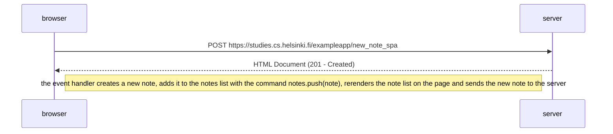

```mermaid
   sequenceDiagram
       browser->>server: POST https://studies.cs.helsinki.fi/exampleapp/new_note_spa
    server-->>browser: HTML Document (201 - Created)
    Note right of browser: the event handler creates a new note, adds it to the notes list with the command notes.push(note), rerenders the note list on the page and sends the new note to the server
```
